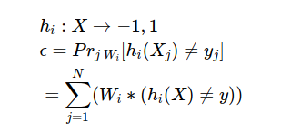
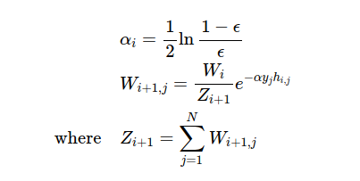
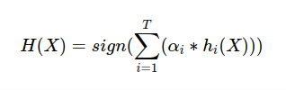

## Introduction

AdaBoost is short for Adaptive Boosting. Boosting is one method of Ensemble Learning. There are other Ensemble Learning methods like Bagging, Stacking, etc.. The differences between Bagging, Boosting, Stacking are:

1. Bagging:  
   Equal weight voting. Trains each model with a random drawn subset of training set.

2. Boosting:  
   Trains each new model instance to emphasize the training instances that previous models mis-classified. Has better accuracy comparing to bagging, but also tends to overfit.

3. Stacking:  
   Trains a learning algorithm to combine the predictions of several other learning algorithms.

## The Formulas

Given a N*M matrix X, and a N vector y, where N is the count of samples, and M is the features of samples. AdaBoost trains T weak classifiers with the following steps:

1. Initialize.

2. Train i-th weak classifier with training set {X, y} and distribution W_i.

3. Get the predict result \\( h_i \\) on the weak classifier with input X.

4. Update.

Z is a normalization factor.

5. Repeat steps 2 ~ 4 until i reaches T.

6. Output the final hypothesis:

## Test

Using a demo from [sklearn AdaBoost](http://scikit-learn.org/stable/modules/generated/sklearn.ensemble.AdaBoostClassifier.html), I got the following result.

Weak classifiers: 200; Iteration steps in each weak classifier: 200:

Weak classifiers: 60; Iteration steps in each weak classifier: 60:

Weak classifiers: 400; Iteration steps in each weak classifier: 400:

We can see the result varies as the number of weak classifiers and the iteration steps change.

Compares with the AdaBoostClassifier from sklearn with 200 estimators (weak classifiers):

## References / Acknowledgement

1. [AdaBoost - Wikipedia](https://en.wikipedia.org/wiki/AdaBoost)
2. [AdaBoost -- 从原理到实现](https://blog.csdn.net/Dark_Scope/article/details/14103983)
3. [A Short Introduction to Boosting](https://cseweb.ucsd.edu/~yfreund/papers/IntroToBoosting.pdf)
4. [Multi-class AdaBoost](https://web.stanford.edu/~hastie/Papers/samme.pdf)

## Author
[Donny](https://github.com/Donny-Hikari)

Find out further information, refer to my blog [AdaBoost - Donny](http://konno-yuuki.com/blog/posts/machinelearning/2018/654416/) (In Chinese).
